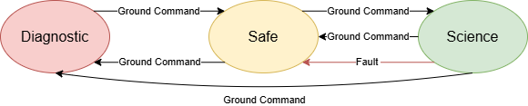
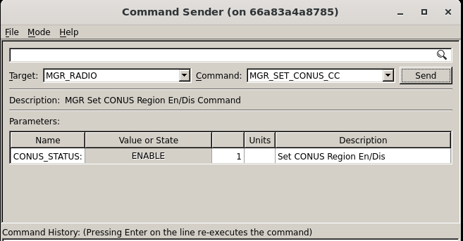
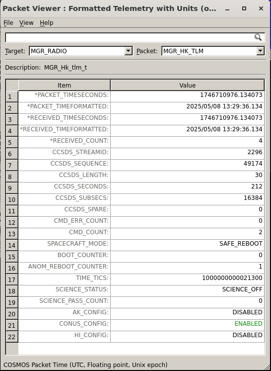
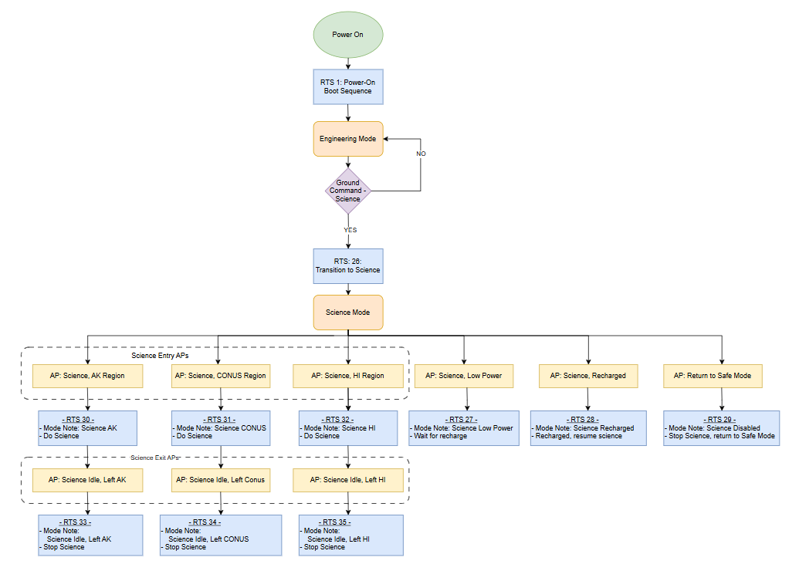

# STF - Concept of Operations (ConOps)

The design reference mission provided with the NASA Operational Simulator for Space Systems (NOS3) is called Simulation To Flight (STF).
STF is a generic mission implementation with documentation to exercise the NOS3 use cases.

## Mission Overview

STF is a science driven mission.
The goal is to do as much science as possible.
Some concessions had to be made for power and data volume to prioritize areas of interest.
The sample payload is assumed to be a sensor studying precipitation over the US.
We only care about the precipitation over the US.
Due to the size of data being produced during collection we will store the collected science data onboard until a ground station contact is scheduled.
The spacecraft provides a means to do pointing for science data collection and optimizing charge. 

## Requirements

Mission requirements typically have levels.
These levels of requirements include requirements, rationale, and traceability between the levels.
The below requirements would not be complete enough for a standard NASA mission, but serve well enough for STF.

* Level 0 - Mission Objectives
  * L0-01: STF shall collect science over the United States: Contiguous United States (CONUS), Alaska (AK), and Hawaii (HI).
  * L0-02: STF shall limit science collection to near the United States.
  * L0-03: STF shall have automated on-board science with fault detection and correction.
  * L0-04: STF shall collect science data for a duration of at least 3 months.
  * L0-05: STF shall get all science data to the ground in under 24 hours from collection.
  * L0-06: STF shall prioritize spacecraft health over science data collection
* Level 1 - Mission Requirements
  * TBD for STF
* Level 2 - System Requirements
  * TBD for STF
* Level 3 - Subsystem Requirements
  * TBD for STF
* Level 4 - Component Requirements
  * TBD for STF

## Spacecraft

The STF spacecraft can be split into the core bus and the science payload.

### Bus

The STF bus contains generic versions of subsystems.
These generic components or subsystems enable the exchange for the next generation of commercial-off-the-shelf (COTS) hardware once they are selected for use.
For STF, the physical subsystems are broken down into the following:
* Attitude Determination and Control System (ADCS)
  * Determine the orientation of the spacecraft and perform any corrections to ensure science or charging is optimal. 
* Communications (COMMS)
  * Maintain the link between ground station and spacecraft, ensuring commands are sent and telemetry is received.
* Electrical Power System (EPS)
  * Managing and monitoring the spacecraft's power generation, storage, and distribution.

### Payload

The STF payload has undergone many updates and continues to evolve with each generation of the mission.
The payload is a sensor studying precipitation over the US.
This payload will safe itself if it detects an anomaly contained in its own subsystems.
If an anomaly is detected, communications are to cease and a power cycle should occur prior to continuing operations.
Due to the nature of the instrument, these are expected and the science teams will take care of data drops in post processing once the data is received.

## Ground Segment

The STF ground segment consists of three key pieces.
The first of these are various physical ground stations, provided commercially, that enable coverage at any point in our orbit (at a cost).
Second we have the Mission Operations Center (MOC) that performs the spacecraft Telemetry, Tracking, and Command (TT&C).
Third is the Science Operations Center (SOC) which performs data post processing and generates higher level science data products.

### Ground Station

Ground stations provide the radio frequency (RF) link between the spacecraft and the MOC.
A number of data type conversions and wrapping occur to get data to and from these kinds of networks.
The STF implementation in NOS3 does not perform any translations for this.
The provided commercial APIs simply accept our data, package, and transmit it while and the radio hardware handles the translation back into the original form provided.

### Mission Operations Center (MOC)

The MOC performs the monitoring of the data from the spacecraft and sets up passes.
For STF, simply sending data will trigger the start of a pass.
We are such a heavy user of the commercial ground station that they always seem to be tracking us at the ground station and provide us with a seemingly lossless link to the vehicle.

### Science Operations Center (SOC)

The SOC is always changing the manner it stores raw data, post-processes into various science data produces, and makes that data available to the public.
This document was written in a time of flux in determining these steps and as such has omitted details of this to be captured elsewhere.

## Operations

A spacecraft operator is a trained professional responsible for day-to-day management, control, and monitoring of a spacecraft.
While traditionally spacecraft have required operators, a recently push for "lights out" operations has been noted.
This "lights out" or autonomous operation is the goal of the STF mission, but would be developed after the vehicle is on orbit and any procedures are proven.
Notifications to spacecraft operators would be generated for them to get to a console to resolve any issues as they arise.

### Spacecraft Modes

The STF spacecraft has three modes:
* Diagnostic
  * All components of the vehicle are disabled
  * The spacecraft is left to tumble
  * Manually entered and exited
* Safe
  * The minimum set of components to sun point the vehicle are enabled
  * The spacecraft points at the sun to optimize re-charging
* Science
  * The science payload can be enabled to collect data
  * Sub-modes exist within for charging and science data collection and are automatically switched between depending on location
  * Has a number of additional fault detections, if any are realized go to safe mode

### Launch and Commissioning

As mentioned previously, initial commissioning is to be performed by a spacecraft operator.
The spacecraft will be launched in the "Safe" mode.
Commissioning activities will involve testing each physical component on the spacecraft individually before enabling standard or nominal operations and performing science data collections.

### Nominal Operations

Nominally the spacecraft will autonomously transition between sub-modes within the spacecraft science mode.
Should any fault be detected the spacecraft will fail back into safe mode.
A spacecraft operator will need to investigate the cause and take any desired action in correction prior to returning to science mode.

### Science Mode

Science Mode is based on data collection above specific regions of interest. 
In this example, we are interested in turning on our Sample Instrument over three different regions: Alaska, Hawaii, and the Contiguous US (CONUS).
We achieve the region bounds by drawing boxes over our regions of interest, and using GPS coordinates to know when it is appropriate to automatically turn on the instrument, and then when to halt doing science as we exit an area of interest.
Therefore, Science Mode requires Latitude and Longitudes from the GPS to function appropriately.

Science Mode is configured by ground commands. With the spacecraft in Safe Mode, the operator can configure the desired science regions by sending the appropriate commands, e.g. MGR_SET_CONUS_CC.

Region status is verified by using the Packet Viewer to see which regions are enabled or disabled.

With the science regions configured, if commissioning has been complete, the operator can send the MGR App command to Set_Mode to Science.

At a moderate level of detail, the Limit Checker App utilizes Actionpoints (APs) to determine when to perform the functions needed for science. When a Limit Checker Actionpoint is tripped, it causes a sequence of commands to be sent to flight software. These sequences of events are called Relative Time Sequences (RTSs).
An example of the Modes, APs, and their associated RTSs is shown at a moderate level of detail below.

#### Per Pass Operations
Prior to the pass, the spacecraft operator should make note of the contact start and end times.
The operator should identify any files that are planned to be uploaded and that they exist in the correct location.
The operator should formulate a game plan of goals for the pass including commands and files to uplink and telemetry and files to downlink.
Because each pass may be a brief amount of time (roughly eight minutes in Low Earth Orbit), the operator should determine beforehand what data is to be downlinked during the pass and what other operations should be performed during the pass.
The operator should log into the console where they will be commanding/controlling the satellite and make sure that all ground software applications and windows are functional and ready prior to official connection.

During the pass, the first thing the spacecraft operator should do is command the spacecraft radio transmitter.
The next thing the spacecraft operator should do is request and confirm key health and status telemetry for the spacecraft including what mode the spacecraft is in, the state of charge of the battery, and any other indicators of error.
The operator should also see that the command and telemetry counters are incrementing as commanding is performed and telemetry is received.
Once this necessary information has been collected, the spacecraft operator should issue commands to start or stop relative time sequences, to start telemetry collection, to uplink or downlink files, to command the state of the spacecraft and any onboard experiments, etc.  
The spacecraft operator should also manage the onboard storage of the spacecraft such as monitoring the free storage remaining and deleting files/telemetry that have been verified to have been downlinked.
The spacecraft operator should also monitor the health and status of the spacecraft during the pass.
Essentially, each pass should begin with confirming the spacecraft mode and general health, and then proceed to sending commands to change the state of the spacecraft or its onboard experiments.  This latter category also includes downlinking data from the spacecraft to the ground, which is likely what will comprise the bulk of most passes.

Near the end of the pass, the spacecraft operator should disable the spacecraft radio transmitter.
After the pass, the spacecraft operator should also kickoff any procedures needed to process the telemetry and files received during the pass.

### Contingency Operations
Anomalies may occur with the ground software, the ground station, or the spacecraft software.
Examples of these may be that the ground software does not connect to the ground station, the spacecraft radio does not respond to commanding, an experiment is inoperable, or another spacecraft component failed.
If the anomaly is minor, the spacecraft operators may be able to correct it in real time.
Otherwise, the spacecraft operators can confirm the vehicle is safe and take the issue offline to study the anomaly in more detail.
This may include bringing in more experienced personnel to guide them in formulating future pass plans to address the anomaly and to develop anomaly reports once the anomaly is resolved.

### End-of-Life

Once the STF vehicle has deteriorated to a point where it is no longer operational, some special steps will be taken to further safe the vehicle and prepare for re-entry.
These include disabling the EPS from continuing to charge the battery and utilizing the thrusters to induce an early reentry into the atmosphere where the vehicle would burn up and no longer be a hazard to other vehicles for collision.
