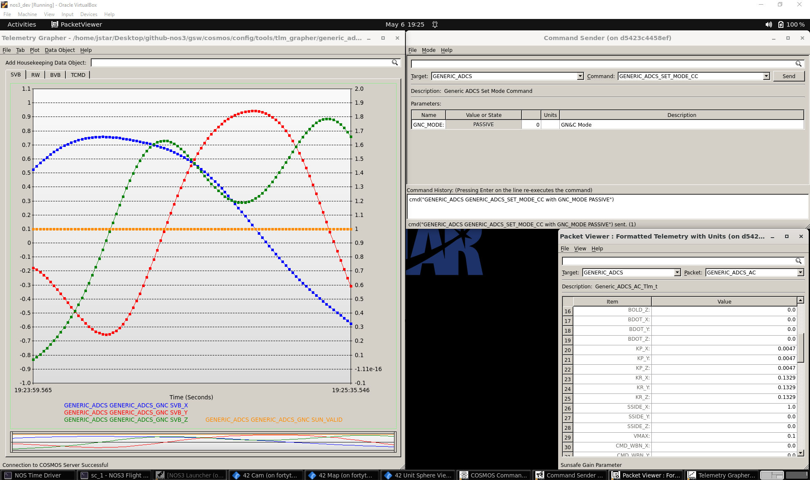
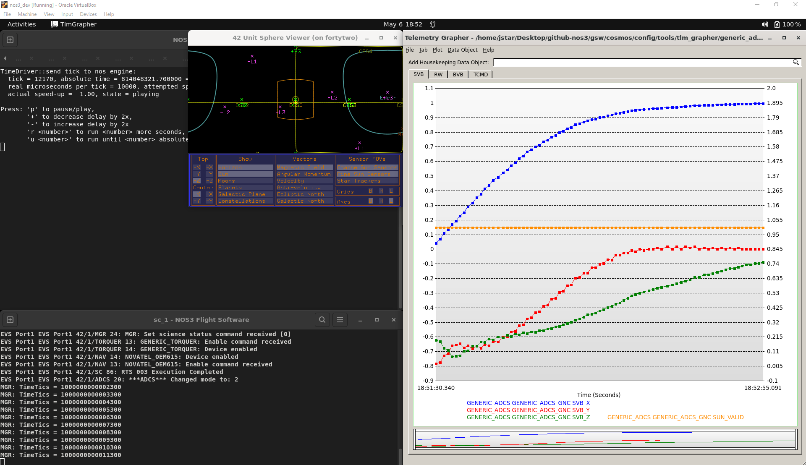
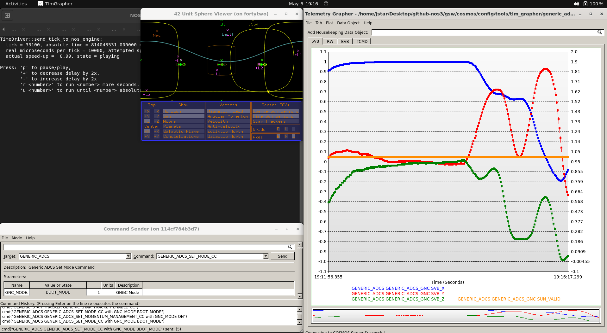
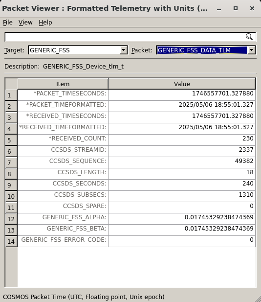
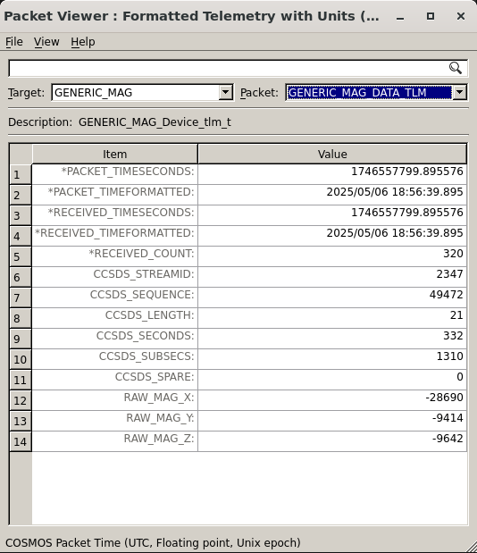
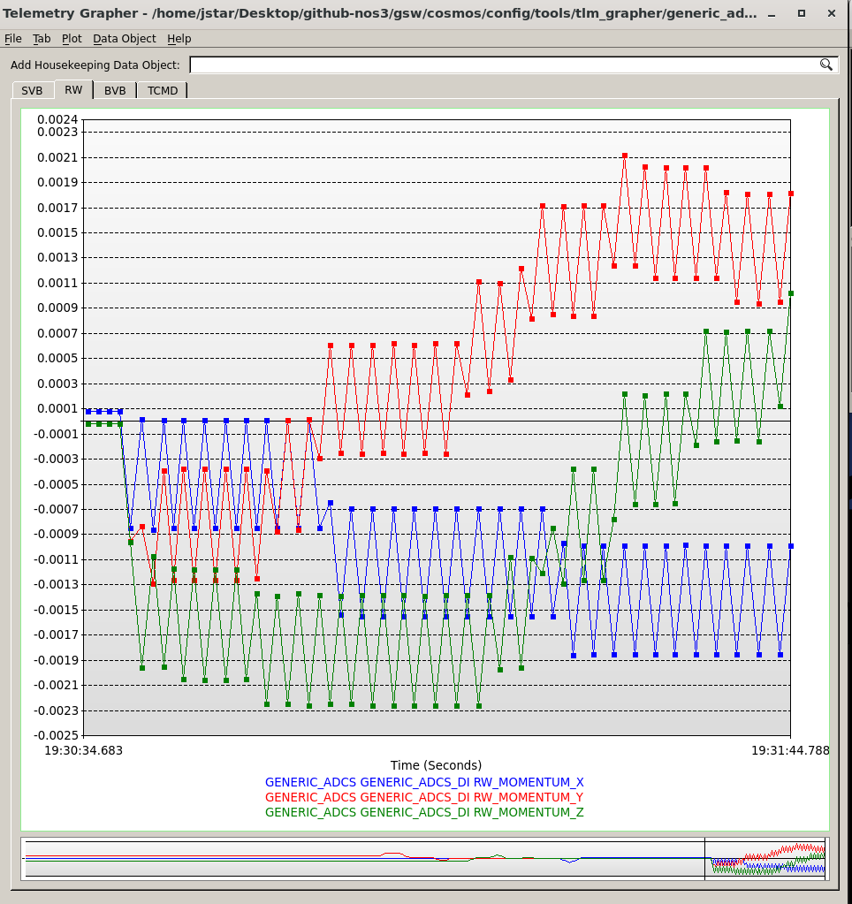
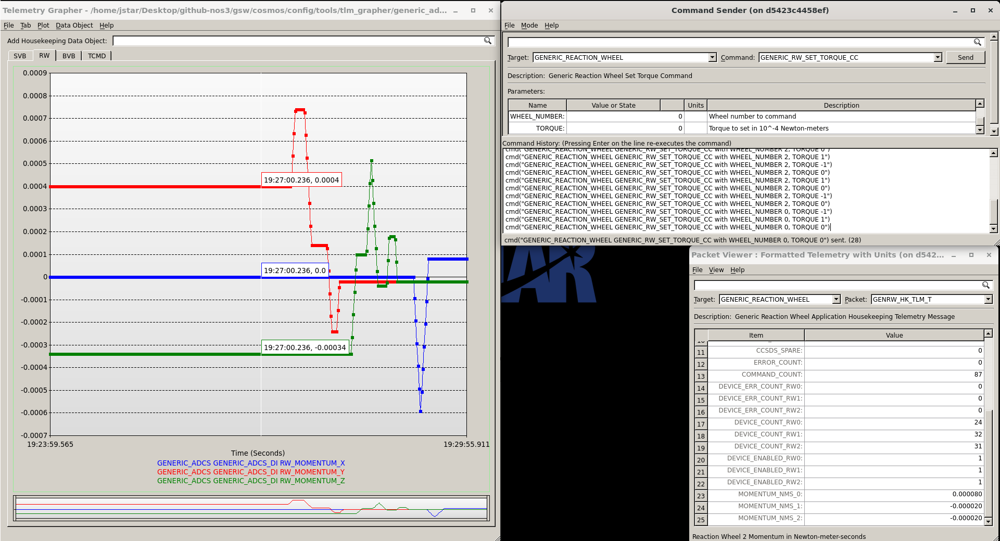
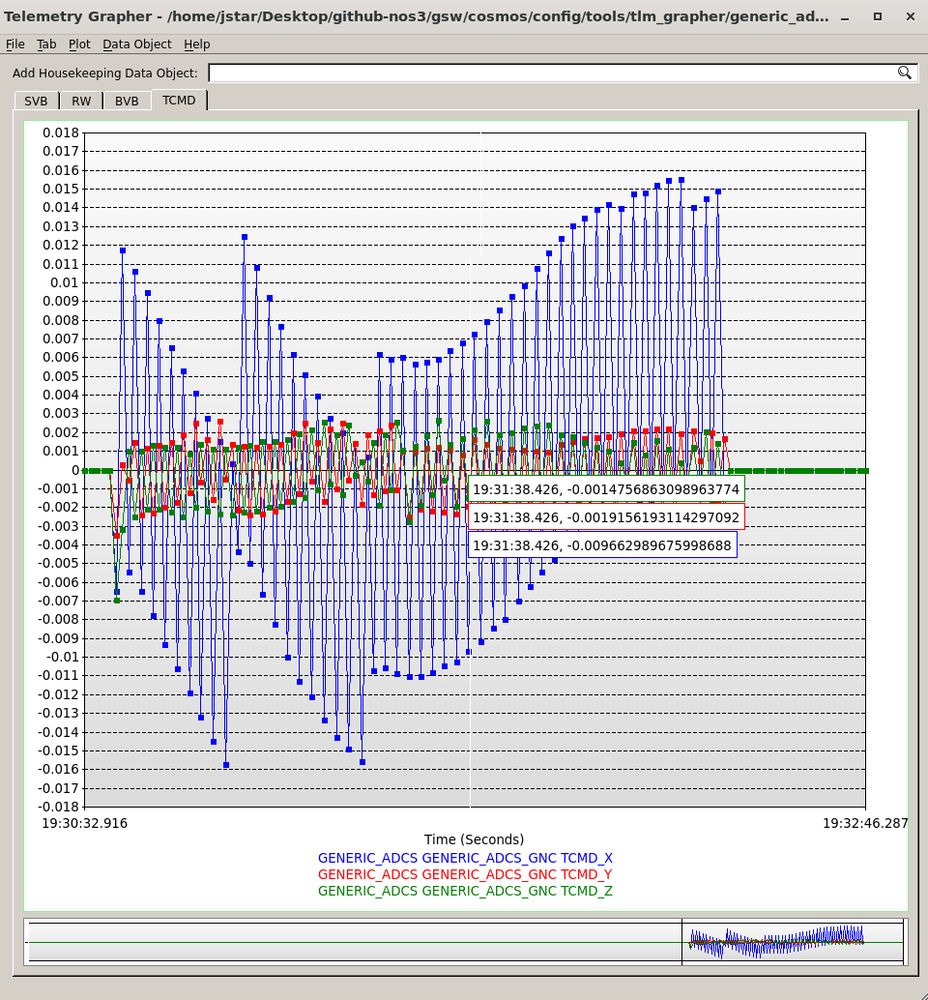

# Scenario - ADCS Walkthrough

This scenario was developed to provide a walkthrough of NOS3's basic Attitude Determination and Control System (ADCS).

This scenario was last updated on 06/10/2025 and leveraged the `dev` branch at the time [a3e7c100].

## Learning Goals
By the end of this scenario you should be able to:

* Understand the basics of the Attitude Determination and Control and Sensor Fusion components.
* Understand some basic ADCS modes and how they operate.
* Understand the various sensors and actuators utilized by the ADCS to perform its function.
* Understand the cFS bus and how it can be utilized by a sensor fusion component to take in data and command other components.

## Prerequisites
Before running the scenario, complete the following steps:

* [Getting Started](./NOS3_Getting_Started.md)
  * [Installation](./NOS3_Getting_Started.md#installation)
  * [Running](./NOS3_Getting_Started.md#running)
    
## Walkthrough

### Introduction
The Attitude Determination and Control System (ADCS) is different from other components in NOS3. This is because it serves as a sensor fusion component rather than interfacing with a sensor or actuator directly. It takes in the inputs from various sensors and actuators and uses them to orient and navigate the spacecraft as specified. NOS3's ADCS comes equipped with four main modes: Passive, Sunsafe, Inertial, and BDOT.

### Modes
* Passive mode turns ADCS control of the spacecraft off, leaving it to the operator to command the actuators manually.

* Sunsafe mode utilizes the Fine Sun Sensor and Coarse Sun Sensor to determine if the spacecraft is in sun, as well as the orientation between the spacecraft body frame and the sun unit vector. It then uses the reaction wheels and magnetorquers to keep the spacecraft pointing in an optimal charging position.
  

* Inertial mode utilizes the Star Tracker and Inertial Measurement Unit data together with the reaction wheels and magnetorquers to orient the spacecraft relative to an inertial frame of reference.
  

* BDOT mode uses the IMU and Magnetometer data and the reaction wheels and magnetorquers to stabilize the spacecraft and drive the rotation rate to zero.

### Sensors
* The Coarse Sun Sensors (CSS) are located with one on each face of the spacecraft and provide a voltage output based on how much light is shining on them. This gives a rough idea of whether a particular face is in the sun.
  

* The Fine Sun Sensor (FSS) provides a more accurate reading of the spacecraft's orientation relative to the sun, as long as the sensor is in sun.
  

* The Inertial Measurement Unit (IMU) utilizes accelerometers and gyroscopes to measure the linear acceleration and angular rate, respectively.
  

* The Magnetometer (MAG) measures the spacecraft's orientation relative to the Earth's magnetic field. This allows the spacecraft to know in which direction each magnetorquer will move the spacecraft by relating the body frame of the spacecraft to the Earth's magnetic field.
  

* The Star Tracker (ST) uses images of the stars and a star catalog to determine the spacecraft orientation with respect to a fixed inertial frame of reference.
  

### Actuators
* The Reaction Wheels (RWs) are flywheels which can spin to generate torque and allow the spacecraft rotate, and point itself. There is one for each axis, which can be spun in either direction on that axis.

* The Magnetorquers, or Torquers, utilize electromagnets and the Earth's magnetic field to produce weaker torques than the Reaction Wheels, aligned to the Earth's magnetic field. They can be used to slowly dump angular momentum from the reaction wheels, however, since reaction wheels can only handle a certain amount of torque before they max out.

* Thrusters are not linked into ADCS or fully developed for this example mission, but they would allow orbital adjustments and navigation in the linear axes.  When used together, they can also be used to allow adjustments in the rotational axes, and serve in this role on deep space missions, where they achieve a similar end (dumping angular momentum) as the magnetorquers in Earth orbit.
  
### Ingest and Output
As this mission uses cFS, it is built on a bus-based architecture. All messages are published to a single bus, which other components can subscribe to. Because of this, the ADCS sensor fusion works by subscribing to the various sensors' messages in ADCS, so it can read them into itself and act on them. This subscription process happens in the `Generic_ADCS_AppInit` method of **/nos3/components/generic_adcs/fsw/cfs/src/generic_adcs_app.c**. As can be observed there, it subscribes to other cFS apps for the sensors/actuators (MAG, FSS, CSS, IMU, RW, Torquers, and ST), but also subscribes to or initializes various 42 configurations tied to ADCS, specifically Inp_DI.txt, Inp_ADAC.txt, and Inp_DO.txt. This ensures it is properly linked to the dynamics simulator.

Then, as the ADCS app processes commands, it will filter out its own ground commands and telemetry requests, and then check for each of the telemetry packets from the aforementioned sensors. At this point, it will call ingest methods on those packets to parse out the data into its own "*structs*", and update its own telemetry points. If you would like more information, look at the "generic_adcs_ingest.c" file. This file can be found in **/nos3/components/generic_adcs/fsw/cfs/src/generic_adcs_ingest.c**.

This data is then used internally by the ADAC (Attitude Determination and Attitude Control) method. This is called with the scheduler and parsed in the same function in app as mentioned above, which calls a method within **/nos3/components/generic_adcs/fsw/cfs/src/generic_adcs_adac.c**. This method then loads the ingested data into internal data structs and determines what mode ADCS is in. Next, it will call the associated function, which will use that data to determine what actuator commands need to be sent out to achieve its desired result, and then will build up those commands.

Then, those commands built by ADAC are sent by means of the output methods, which build proper CCSDS packets which may be sent over the cFS bus. These will then be received by the associated actuator and processed to produce the desired effect. If you would like more information, look at the "generic_adcs_output.c" file. This file can be found in **/nos3/components/generic_adcs/fsw/cfs/src/generic_adcs_output.c**.

### Example
For Sunsafe mode, the ADCS system will take in the values for the sun vector from FSS and CSS, as well as their validity signals. It will then utilize that telemetry to determine if the spacecraft is in sun and the orientation between the spacecraft body frame and the sun unit vector. ADCS will then send torque commands to orient the spacecraft to properly face the sun. If you would like to see how it works in code, look at the 'AC_sunsafe' method in **/nos3/components/generic_adcs/fsw/cfs/src/generic_adcs_adac.c**. This file can be found in **/nos3/components/generic_adcs/fsw/cfs/src/**.
