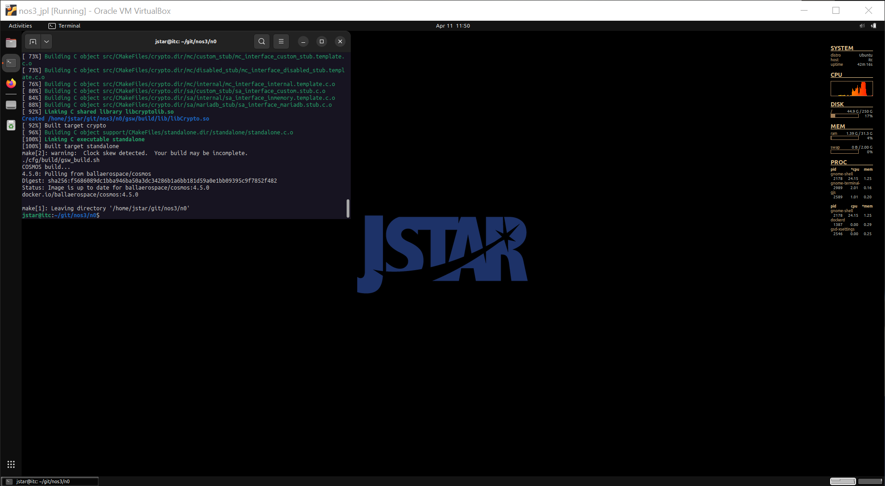
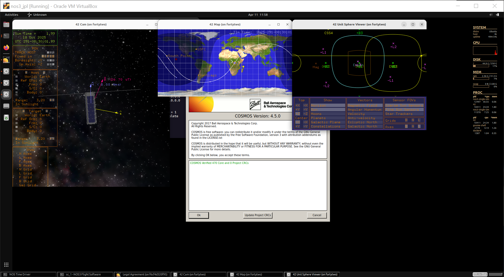
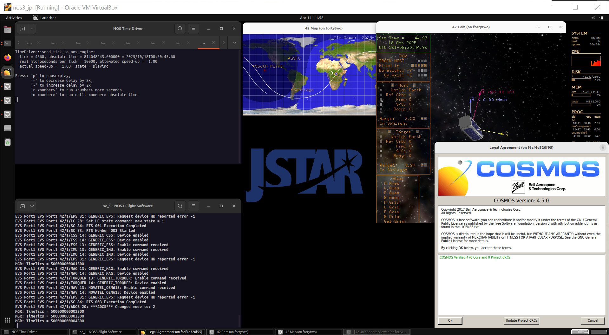

# Scenario - Commissioning

This scenario was developed to provide users with an idea of how to write basic COSMOS scripts to help perform spacecraft commissioning.

In the real world, post-launch and pre-operations represent an important time to assess and verify the state of the spacecraft.
Before science can begin, subsystems need to be checked for nominal states and health.
Once these are confirmed, science can be performed and basic 'control' of the spacecraft can be driven by the science team.

This scenario was last updated on 09/15/2025 and leveraged the `dev` branch at the time [422f66ec].

## Learning Goals

By the end of this scenario, you should be able to:
* Write simple COSMOS scripts using prompts, wait_checks, and message boxes.
* Send commands and receive telemetry using COSMOS Scripting.
* Understand the basic goals of spacecraft commissioning and checkout.

## Prerequisites

Before running the scenario, complete the following steps:
* [Getting Started](./NOS3_Getting_Started.md)
  * [Installation](./NOS3_Getting_Started.md#installation)
  * [Running](./NOS3_Getting_Started.md#running)
* No additional file changes or special setup is needed for this scenario

## Walkthrough

With a terminal navigated to the top level of your NOS3 repository:
* `make`



* `make launch`



* Then, organize the windows for ease of use:



Now we start the COSMOS ground software:
* Click the `Ok` button, followed by the `COSMOS` button in the top left of the follow NOS3 Launcher window that appears.
* Note you may minimize this NOS3 Launcher, but do not close it.
* Our focus is using the COSMOS windows to assist with what we're accomplishing. You may minimize the 42 GUI windows to simplify your environment if you desire.

---
### Identifying Important Commissioning Data

Commissioning varies from mission to mission. Sometimes it's scripted and sometimes it's hands on. 
At a basic level, we want to confirm the health of our spacecraft, and prepare it for science mode in the future.
In the real world, commissioning could generate data that various subsystem teams would need to analyze before giving their 'green lights' to proceed with science.


Let's discuss and identify the minimum information we need to make sure our spacecraft is healthy. 
We'll do this by answering some basic questions:
* How much power do we have?
* What state does the spacecraft think it's in?
* Are we having weird reboots?
* Can we turn on the instrument briefly?
* Can we configure science mode, so we're ready to go when science says we can?

Using the above questions, take a few minutes to look through the COSMOS Packet Viewer for the following packets: EPS, MGR, and SAMPLE. 
* What packet fields did you identify as being necessary to answer these questions?

---
### Writing a Commissioning Skeleton

* In a text editor, such as VSCode, navigate to gsw/cosmos/config/targets/MISSION/procedures and create a new file 'my_commissioning.rb'
* (Note that if you need help for the following steps, you can consult the script 'commissioning.rb')
* In the first line, write 'require 'mission_lib'

Let's add Ruby comments to help us navigate what we'll be doing for our commissioning, add the following lines with a blank line or two in between
* `# Turn on the radio`
* `# Check our power`
* `# Verify our state`
* `# Check for odd reboots`
* `# Turn on the instrument`
* `# Configure Science Regions for future use`
* `# Turn off the radio`

---
### Enabling the Radio
To enable the radio, add the following lines to the script:
```
cmd("CFS_RADIO TO_ENABLE_OUTPUT with DEST_IP 'radio-sim', DEST_PORT 5011")
cmd("CFS_RADIO TO_RESUME_OUTPUT")
wait_check_packet("CFS_RADIO", "CF_HKPACKET", 1, 5) 
```


### Checking our Power State

Let's generate a template we can use to check out our other items. 
We'll do this with the EPS voltage check.

```
# Check our power
prompt("Proceed with battery voltage check, Press OK to continue.")
wait_check_packet("GENERIC_EPS_RADIO", "GENERIC_EPS_HK_TLM", 1, 10) 
battery_bus_voltage = tlm("GENERIC_EPS_RADIO GENERIC_EPS_HK_TLM BATT_VOLTAGE")
message_box("Battery bus voltage reported to be #{battery_bus_voltage} volts.", "OK", false)
```

What we've accomplished above is a block that:
* Checks if we're ready to check a telemetry point.
* Waits for a fresh value for that telemetry packet.
* And finally, clearly prints the value to a screen.

Try out the partially completed script by 
* Launching "Script Runner"
* Selecting "File->Open->MISSION/procedures", selecting "my_commissioning.rb", and clicking "Open"
* Clicking "Start"

Now, with the EPS Voltage Check as a template, fill in the items needed for checking state and anomalous reboots.  Use the following telemetry points:
* MGR_RADIO MGR_HK_TLM SPACECRAFT_MODE
* MGR_RADIO MGR_HK_TLM ANOM_REBOOT_COUNTER

### Commands as part of templates

There are a few ways to accomplish commanding, but we'll keep it simple. 
We still need to finish our blocks for turning on the instrument and configuring science!
* COSMOS scripting makes sending a command as easy as using the following syntax: _cmd("SAMPLE_RADIO SAMPLE_ENABLE_CC")_
* Using that information, write command blocks for the instrument that:
  1) Generate a prompt for permission to continue
  2) Enables the Sample Instrument
    
      Use command "SAMPLE_RADIO SAMPLE_ENABLE_CC"
  
  3) Generate a prompt for when to proceed to turn it back off
  4) Generates a prompt to disable the sample device
  5) Disables the Sample Instrument

      Use command "SAMPLE_RADIO SAMPLE_DISABLE_CC"

Now, we will configure science mode. The difference between this and the above commands is that the science mode commands take arguments, whereas we didn't need arguments in the above commands.

* A sample Enable Science Region command looks like: `cmd("MGR_RADIO MGR_SET_AK_CC with AK_STATUS ENABLE")`
* Using the above as a template, write a new section to our script that will:
  1) Prompt if it's OK to configure science regions
  2) Enable AK
  3) Enable CONUS
  4) Enable HI

      View the "MGR MGR_HK_TLM" packet to verify these science regions have been enabled.

Try out the partially completed script again.

### Turn the Radio On and Off

We're almost done! 
* Turning our radio on and off for transmit is a critical part of some missions.
* If a radio is left on, it could kill the spacecraft.
    
    We have already added commands to the script to turn on the radio

* The last thing we must do is to turn the radio off. At the end of your file, add a block that does the following:
  1) Prompt for permission to turn off the radio
  2) Sends the CFS_Radio Command to disable telemetry output

      Use command "CFS_RADIO TO_DISABLE_OUTPUT"

**Let's run the final script and see how it works!**
