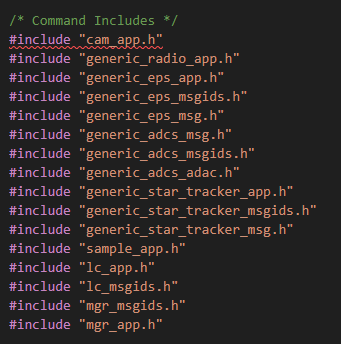
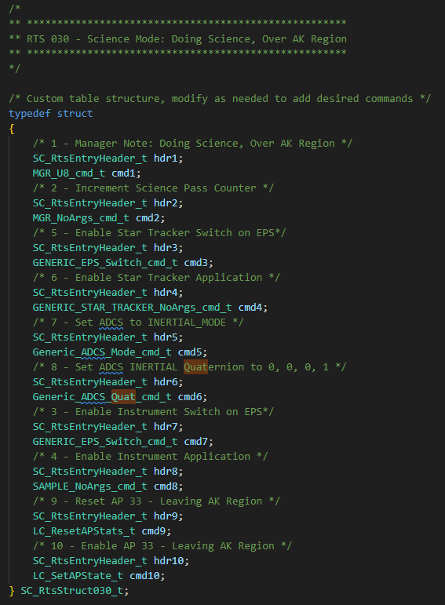
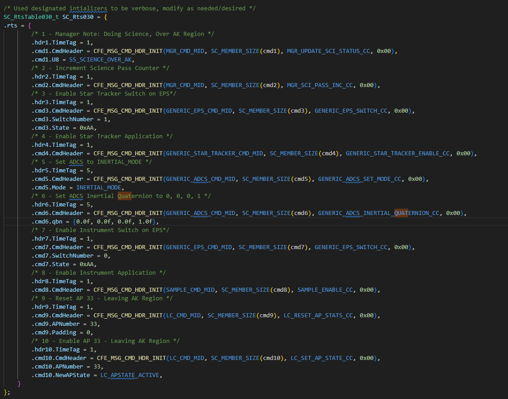
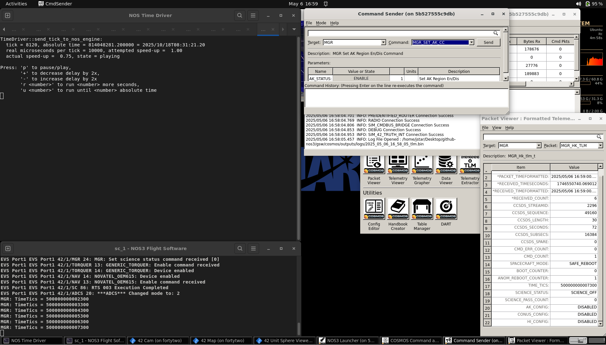
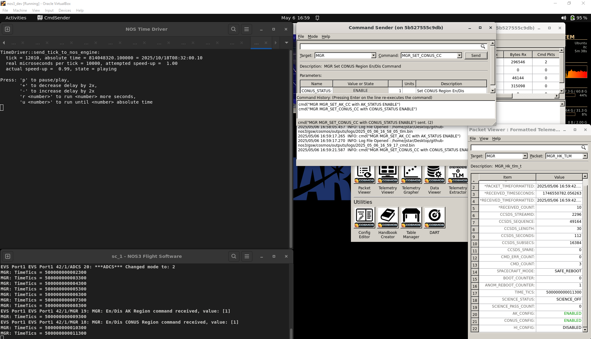
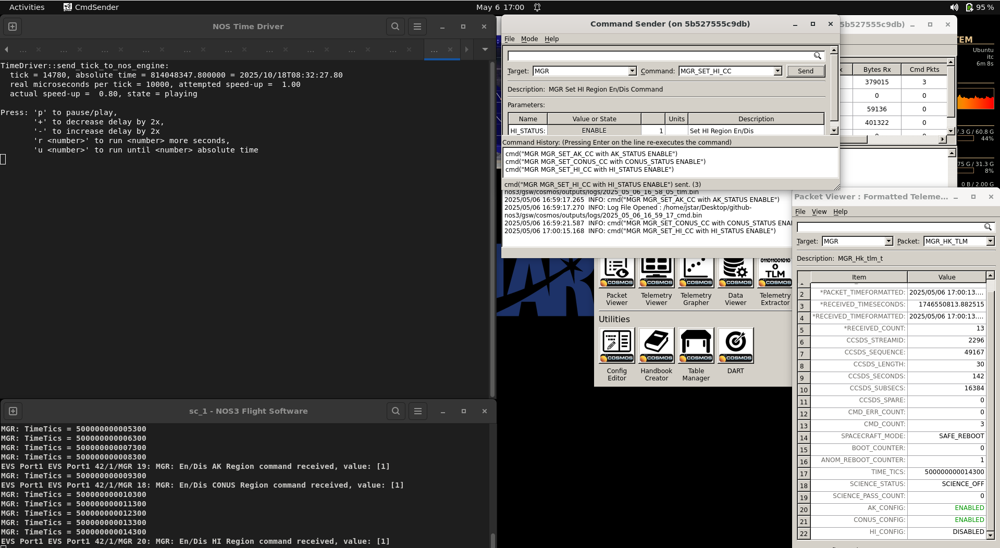
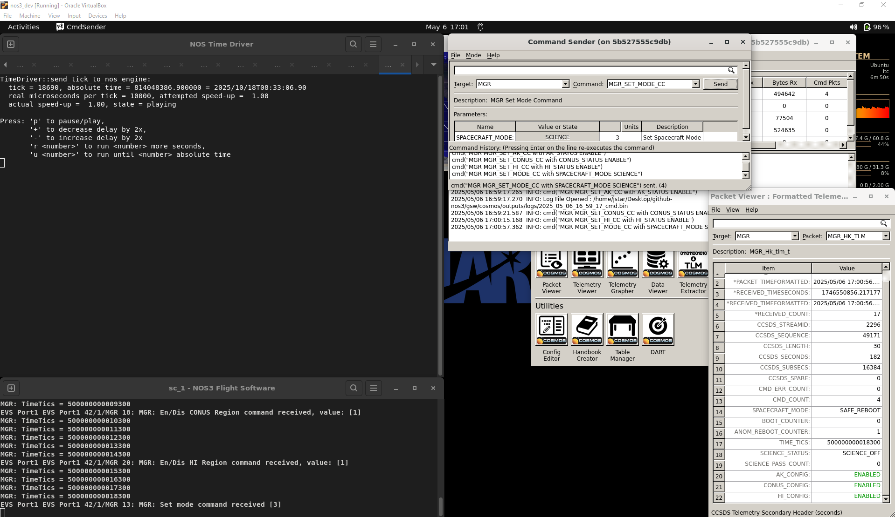
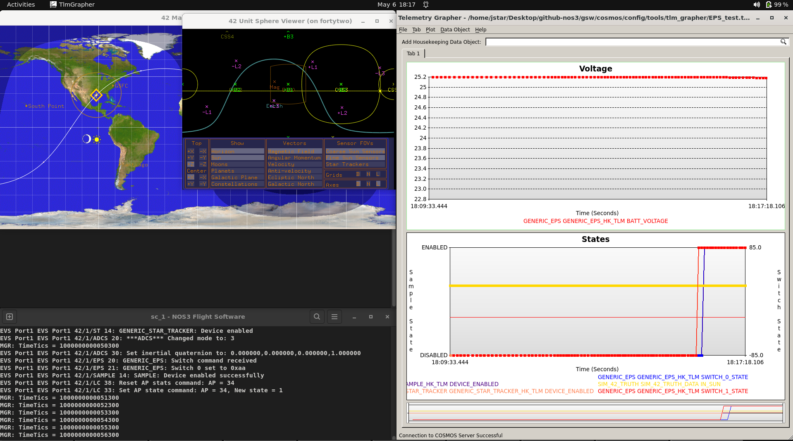
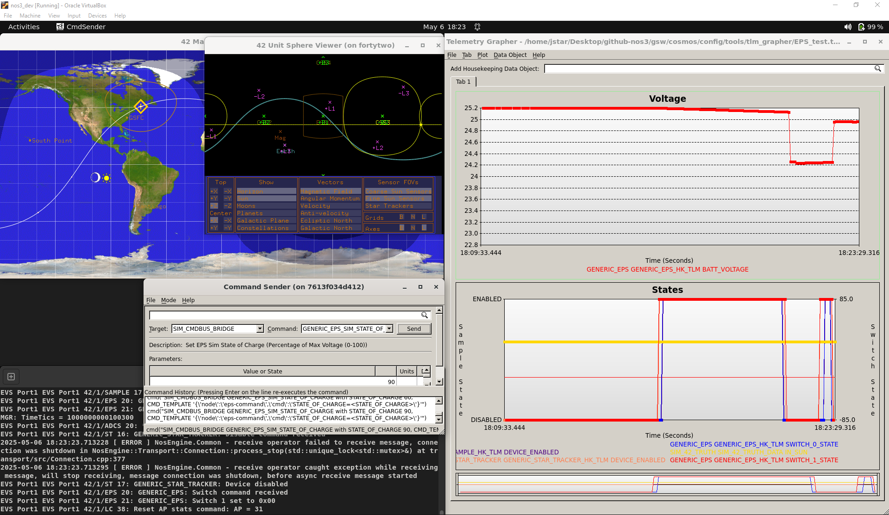

# Scenario - Commanding ADCS in Science Mode

This scenario was developed to demonstrate how to adapt an existing mission to changing science goals, with the specific example of a request for a different pointing routine during Science Mode.

This scenario was last updated on 06/09/2025 and leveraged the `dev` branch at the time [a3e7c100].

## Learning Goals
By the end of this scenario you should be able to:
* Understand how to plan effectively before making changes to ensure you:
  * Identify everything you need to do to cover the behavior you intend. 
  * Ensure things are returned to a known state afterwards.
* Understand how to modify existing RTSs to match new parameters.
* Understand how to test these changes and related edge cases in NOS3.

## Prerequisites
Before running the scenario, complete the following steps:

* [Getting Started](./NOS3_Getting_Started.md)
  * [Installation](./NOS3_Getting_Started.md#installation)
  * [Running](./NOS3_Getting_Started.md#running)

You should also review the following before beginning this scenario:
- [STF - Quick Look](./STF_QuickLook.md)
* [Scenario - ADCS Walkthrough](./Scenario_ADCS_Walkthrough.md)
* [Scenario - Device Fault in Science Mode](./Scenario_Fault_Science.md)

## Walkthrough

During routine mission operations, the Science Team has noticed that the implemented sunpoint angles lead to a non-optimal rotation of the craft for collecting science data. They therefore request that the Operations Team ensure the craft is pointed to a rotational quaternion of `[0, 0, 0, 1]` while taking science data. 
We (as members of the Operations Team) will need to modify our existing RTS tables to ensure that the new mission parameters are being fulfilled and that any new edge cases are covered.

### Step 1 - Planning
Before making any changes to mission behavior, we must consider what exactly needs to be done, how to do it, where the changes need to be made, and any new edge cases that may arise from this adjustment.

#### Part A: Determining Scope
Science Mode is governed by RTS tables which are triggered when passing certain LC watch points. Since we are only changing behavior _during_ Science Mode, and not the behavior of when or how it is triggered, this means we should only have to modify the RTS tables that govern Science Mode behavior, and not the associated LC watchpoints.

#### Part B: Determining Modifications for Behavior
Now that we've determined the scope, we need to consider what is necessary for inertial pointing that differs from our default configuration:
* Inertial pointing utilizes data from the spacecraft's Star Tracker in order to determine the current Quaternion values. 
* This allows the ADCS to adjust the spacecraft attitude to point towards a specified quaternion. 
Referencing the Quick Look, we see that EPS Switch 1 is tied to the Star Tracker, and it, along with the Star Tracker App, are off by default. 
Thus, we learn we need to:
* Turn on the EPS Switch associated with the Star Tracker by setting Switch 1 to `0xAA` or `170`.
* Enable the Star Tracker App.
* Set the ADCS Mode to Inertial and set the Inertial Quaternion for Pointing in ADCS to `[0, 0, 0, 1]`.

#### Part C: Considering Edge Cases
Finally, now that we've determined what is necessary to achieve that behavior during Science Mode, we need to consider the new issues and edge cases that could or will be created by these changes:
* The app and switch for Star Tracker should be disabled when leaving active Science Mode, just as Sample and its switch are:
  * Doing otherwise would waste power and could lead to an inability to charge the craft, or at the least inefficient charging. 
* The ADCS mode should be restored to Sunsafe once we have left active Science Mode:
  * This will optimize our charging angle when not conducting science.
  * It will also mean we are always in a state known to be safe if we exit active science for any reason (such as a fault, ground command, or simply geographic reasons).
This all means we will also need to modify any RTS tables associated with transitions out of active Science Mode or back to Science Passive Mode.

Now, after careful planning, we should be prepared to move on to implementing our changes.

### Step 2: Implementation
To determine which RTS tables require modification, we can either reference the Quick Look or the code itself (searching through relevant commands like the Sample Switch/App Toggles).  We determine the following:
* RTS tables 30, 31, and 32 are the cases where we enter Active Science mode.
* RTS tables 27, 29, 33, 34, and 35 are the cases where we exit Active Science mode.

The former and latter groups will each have their own set of changes, though their numbers in the RTS may change depending on which table you are modifying.

#### Part A: Enabling and Setting Up Inertial Mode
As discussed in planning, this is a process that will require 4 extra commands:
* Enabling EPS Switch 1.
* Enabling the Star Tracker cFS Application.
* Setting the ADCS Mode to `INERTIAL_MODE`.
* Setting the ADCS Inertial Quaternion to `[0, 0, 0, 1]`.
  * _Note: For this, we needed to switch the ADCS Command Structure for the Quaternion command to use `float` instead of `double` (which was used originally and is still used elsewhere in ADCS).  This is because doubles are not currently compatible with cFS tables. This may change in the future, though._

To achieve this, three areas of each RTS table need to be changed:
* The required headers for Star Tracker and ADCS need to be added to the `#include` section of the file, as below:
  
* Then, add the extra commands and headers to the RTS in that section, and shift any existing headers and commands to accommodate:
  
* Finally, add the definitions for those commands and headers to the actual execution section of the RTS, and shift pre-existing commands to accommodate.
  

Although the changes are only shown in RTS table 30, they will need to be made in RTS tables 30, 31, and 32. The commands should be the same, but their location may vary depending on what else the table is doing (though in this case, these 3 tables are quite similar). You can go through each of the aforementioned tables to see how the changes are adapted for that table in particular.

#### Part B: Disabling Inertial Mode and Resetting to Sunsafe
As discussed in planning, this is a process that will require 3 extra commands:
* Disabling the Star Tracker cFS Application
* Disabling EPS Switch 1
* Setting the ADCS Mode to `SUNSAFE_MODE`

To achieve this, three areas of each RTS table need to be changed:
* The required headers for Star Tracker and ADCS need to be added to the `#include` section of the file.
  
* Then, add the extra commands and headers to the RTS in that section, and shift any existing headers and commands to accommodate.
  
* Finally, add the definitions for those commands and headers to the actual execution section of the RTS, and shift pre-existing commands to accommodate.
  

As above, the changes are only shown in RTS table 33, but they will need to be made to tables 27, 29, 33, 34, and 35. The commands should be the same, but where they are located will vary depending on what else the table is doing. You can go through each of the aforementioned tables to see how the changes are adapted for that table in particular.

### Step 3: Verifying Intended Behavior
With this, you should be able to test that it works by bringing up NOS3, launching COSMOS, and commanding the craft to enable data collection over the various regions and to enter Science Mode. Then:

* Launch your Telemetry Grapher to the EPS_TEST preset.
* Add your Star Tracker's Enabled value and the EPS Switch 1 state to the bottom table:
  * The Star Tracker's Enabled value should be on the left axis.
  * The EPS Switch 1 state should be on the right axis, shifted by -85.0:
    * Star Tracker Enabled should be similar to the Sample Enabled configuration, and the EPS Switch 1 should be similar in configuration to the EPS Switch 0.

Once the vehicle enters Science Active, verify that:
* All 4 variables have flipped from their low, disabled states to their high, enabled states. 
* When the spacecraft leaves CONUS, goes to Science Passive Mode (manually or otherwise), or has its state of charge go below 60% (which you can cause with the Sim Bridge commands) you observe that the switches return to their disabled states once the associated RTS has finished running.

### Conclusion
At this point, you should be comfortable with the thought process behind making changes to a mission to meet new needs, adapting the RTS tables to do so. In future Scenarios, we will build upon this with more complex scenarios that may develop in flight.

