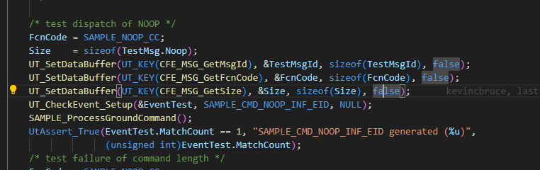
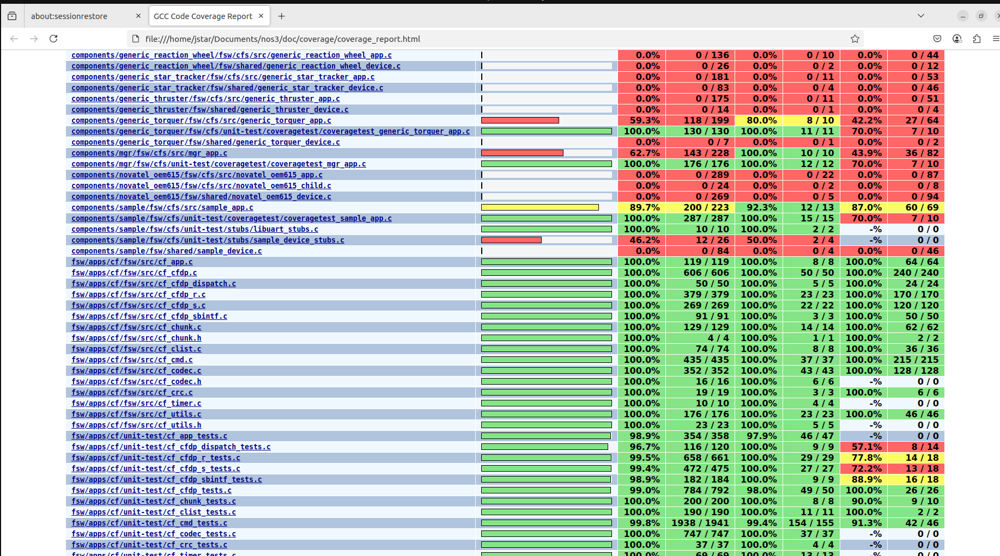

# Scenario - Unit Test Creation

This scenario was developed to demonstrate how to create a unit testing framework for a component within NOS3.

This scenario was last updated on 06/10/2025 and leveraged the `dev` branch at the time [b87b2f92].

## Learning Goals 

By the end of this scenario you should be able to: 
* Create unit tests to check the functionality of NOS3 satellite components and their commands.
* Create unit tests for a brand new component or add to an existing test suite.
* Reach full coverage for all relevant files within a component.

## Prerequisites 
Before running the scenario, complete the following steps:
* [Getting Started](./NOS3_Getting_Started.md)
  * [Installation](./NOS3_Getting_Started.md#installation)
  * [Running](./NOS3_Getting_Started.md#running)

Note that the `make code-coverage` command can only be run if NOS3 is cloned directly into the Linux environment.
The command will not work if using shared folders from your host into VirtualBox (install option A).

## Walkthrough

### File Structure Exploration
With a terminal navigated to the top level of your NOS3 repository:
* `cd /nos3/components/sample/fsw/cfs/unit-test`
* If there is no unit-test directory within the cfs directory of your component, either copy one from sample or generate one with the sample script.
* Ensure that the unit-test folder where you are working is within the fsw/cfs/ directory.

Once you are in the unit-test folder:
* Run the command `ls`.
* You should see `CMakeLists.txt  coveragetest/  inc/  stubs/` as the output. If any files are missing, copy them from the sample component or use the sample script to generate them.
* Open the `CMakeLists.txt` file.
* Check that the name matches the component you are working with. If not change them to match. Then close the file.
* Navigate to the `coveragetest/` and run `ls` again.  You should see `coveragetest_sample_app.c  sample_app_coveragetest_common.h` as the two files within this directory. The `coveragetest_sample_app.c` is where you will be writing the unit tests.
* `cd ..` out of `coveragetest`, run `cd inc`, and open `ut_sample_app.h`.  Then ensure that the filenames being included here match the component you intend to work on.
* Finally `cd ..`, `cd stubs`, and `ls`.  You should see `libuart_stubs.c  sample_device_stubs.c`.
* Again, check both files to make sure the component name matches the one with which you are working.
* `cd ..` and `cd coveragetest/`
* open `coveragetest_sample_app.c`

---
### Writing Unit Tests
Look inside the `coveragetest_sample_app.c` file. This file is where you will write your actual unit tests.
* Within the coveragetest file you will see an array of existing functions such as `Test_SAMPLE_AppMain`, `Test_SAMPLE_AppInit`, `Test_SAMPLE_ProcessCommandPacket`,`Test_SAMPLE_ReportHousekeeping`, etc.
* These functions are split up this way to interact directly with similarly named functions in the `sample/fsw/cfs/src/sample_device.c` file.

---
### Example of NOOP Test
The following is a specific example of a test, found within the `Test_SAMPLE_ProcessGroundCommand` function:

* The FcnCode is the command code. It is a key part of understanding the mechanics of NOS3. It is how the flight system is able to know which command is being sent and - in this case - specifies which command is being tested. 
* The `Size = sizeof(TestMsg.Noop)` is how the length of the command is set. The key thing here is that commands without accompanying arguments all share one size.  Commmands that have arguments associated with them, in this case config, need to have a different size specified in the union struct at the top of the function.
* The
  `UT_SetDataBuffer(UT_KEY(CFE_MSG_GetMsgId), &TestMsgId, sizeof(TestMsgId), false);`
  `UT_SetDataBuffer(UT_KEY(CFE_MSG_GetFcnCode), &FcnCode, sizeof(FcnCode), false);`
  `UT_SetDataBuffer(UT_KEY(CFE_MSG_GetSize), &Size, sizeof(Size), false);`
  lines specify the command string to be sent to cfs and is how the command is sent to the `sample_device.c file`
* `SAMPLE_ProcessGroundCommand();` Runs the command
* `UtAssert_True(EventTest.MatchCount == 1, "SAMPLE_CMD_NOOP_INF_EID generated (``%u)",` checks the results
                  `(unsigned int)EventTest.MatchCount);`

---
### Building/Running the tests and generating a coverage report

Note that the `make code-coverage` command can only be run if NOS3 is cloned directly into the Linux environment.
The command will not work if using shared folders from your host into VirtualBox (install option A).

* `make clean`
* `make config`
* `make debug`
* `make code-coverage -j`
* `exit`
* `firefox docs/coverage/coverage_report.html`

`The coverage_report.html` file will display the code coverage and tests result for every file in the directory.

The resulting file should look like this when opened:

