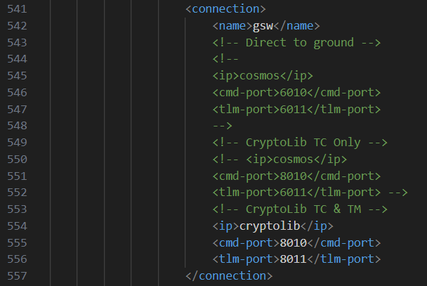
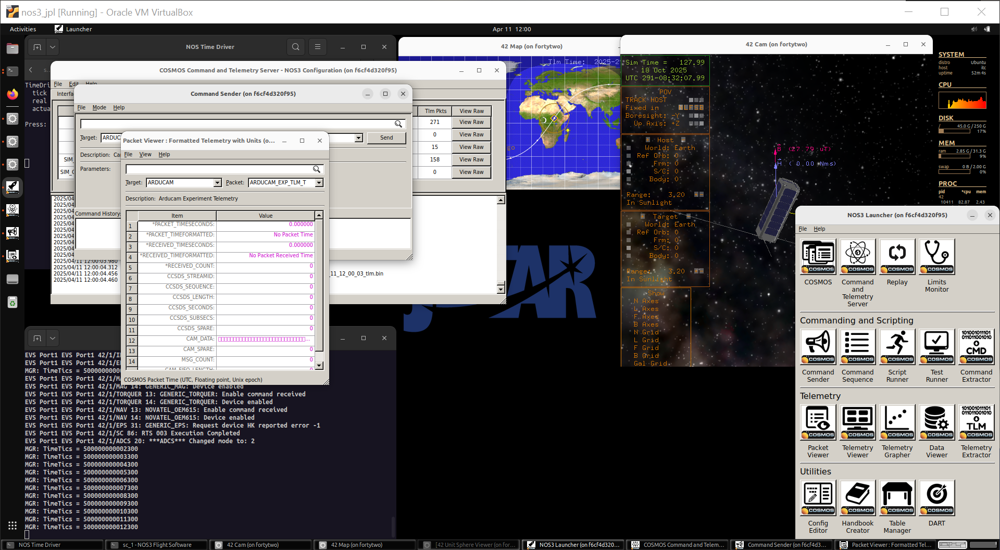
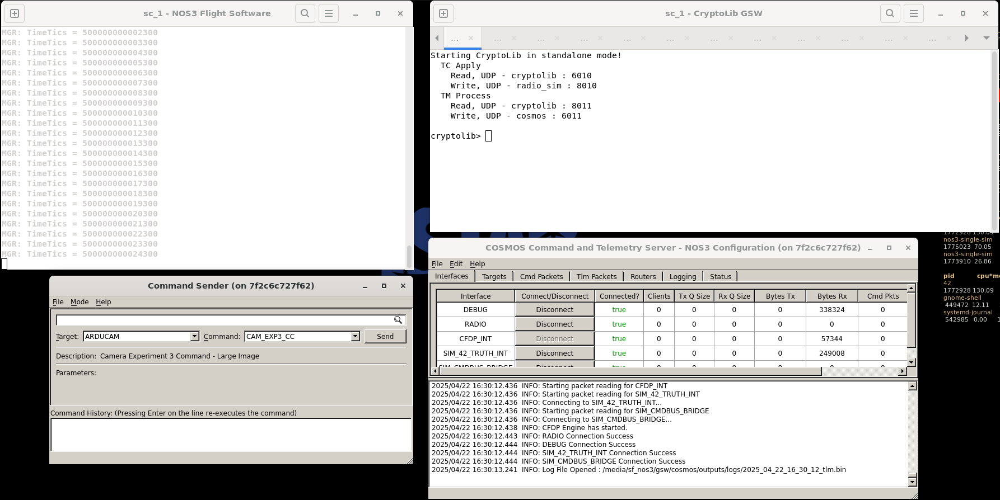
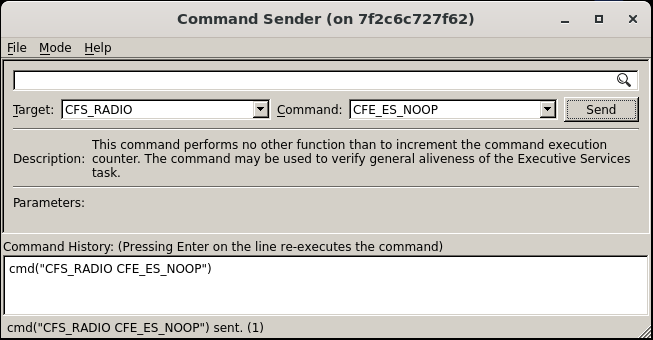
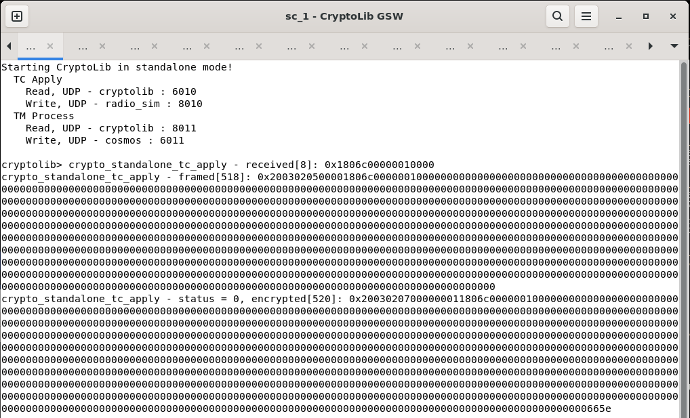
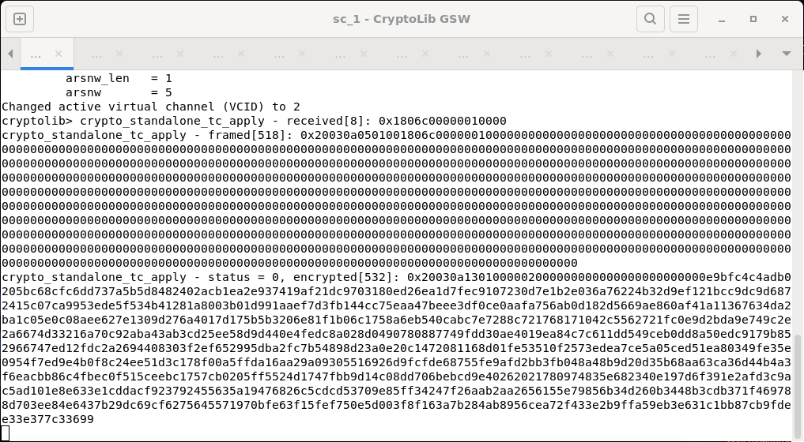
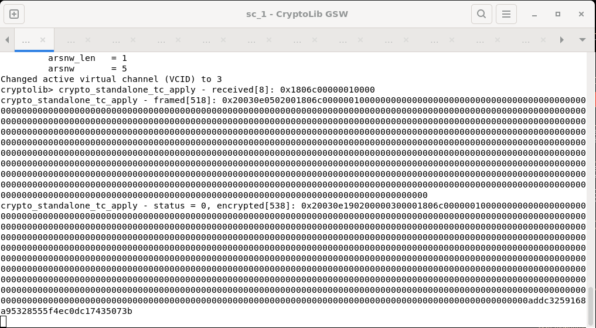
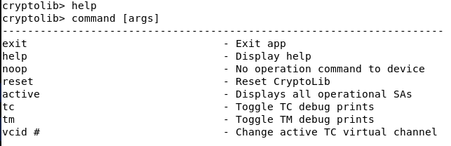

# Scenario - Command Encryption

This scenario was developed as a walkthrough for command encryption in NOS3, as well as an introduction to CryptoLib.

This scenario was last updated on 4/22/25 and leveraged the `619-scenario---command-encryption-walkthrough` branch at the time [2dfbc17].

## Learning Goals

By the end of this scenario, you should be able to:

* Switch between virtual channels via CryptoLib
* Send encrypted or authenticated commands and receive telemetry using CryptoLib
* Verify successful encryption and decryption between FSW, GSW, and simulators

## Prerequisites

Before running the scenario, ensure the following steps are completed:
* [Getting Started](./Getting_Started.md)
  * [Installation](./Getting_Started.md#installation)
  * [Running](./Getting_Started.md#running)

### CryptoLib Config Settings

This section captures what was updated as part of this scenario and why.

Go to `NOS3/cfg/nos3_defs/toolchain-amd64-nos3.cmake` and change line 34 (`TO_TRANSPORT`), as seen in the picture below, from `udp` to `udp_tf`.
This will force NOS3 to format telemetry in a way that CryptoLib can understand.

Next, go to `NOS3/cfg/sims/nos3-simulator.xml` and uncomment lines 554-556 (`CryptoLib TC & TM`), as seen in the picture below.
Make sure the other options are commented out.
This allows the correct ports to be configured for encrypted commanding and receiving telemetry through CryptoLib.

## Walkthrough

With a terminal navigated to the top level of your NOS3 repository:
* `make`

* `make launch`

* Organize the windows for ease of use

* Now we start the COSMOS ground software
  * Click the `Ok` button, followed by the `COSMOS` button in the top left of the follow NOS3 Launcher window that appears
  * Note you may minimize this NOS3 Launcher, but do not close it

### Commanding

To start commanding, navigate to the `NOS3 Flight Software` and  `CryptoLib GSW` terminals, along with the `Command Sender` and `COMSOS Command and Telemetry Server` windows.

CryptoLib is configured for clear-mode commanding with debug prints as default.
To send a no-op command, select the `CFS_RADIO` target and `CFE_ES_NOOP` command in the `Command Sender` window and send the command. 

To send an encrypted command, type `vcid 2` in the CryptoLib window.
This switches the virtual channel that is being used. Now, repeat the previous command.

To send an authenticated command, type `vcid 3` in the CryptoLib window and repeat the previous command.

### Enabling Telemetry Output

To enable telemetry output through CryptoLib, select the `CFS_RADIO` target and `TO_ENABLE_OUTPUT` command in the `Command Sender` window and send the command.
This will cause packets to be decrypted through CryptoLib. 

> To disable the debug output, type `tm` in the CryptoLib window.

You should now see the `Bytes RX` field for the `RADIO` interface increasing on the `COSMOS Command and Telemetry Server` window. 

### Other CryptoLib Commands

All other available CryptoLib commands can be seen by typing `help` in the CryptoLib window.

Congrats, you've made it to the end of the Command Encryption Walkthrough!
