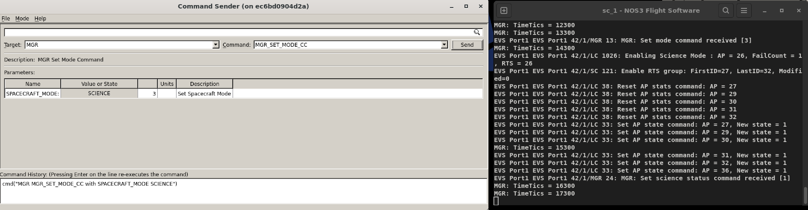
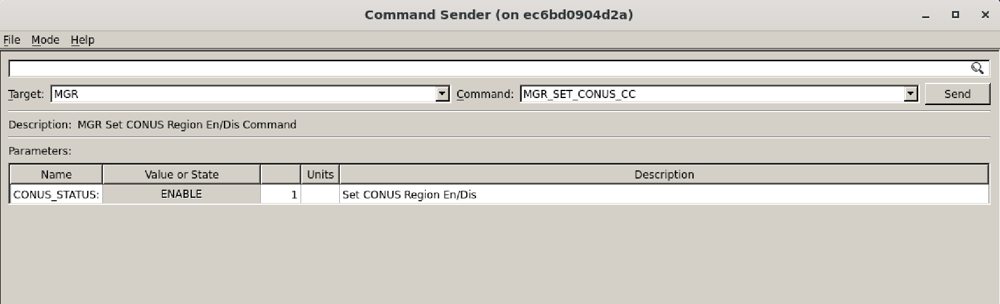
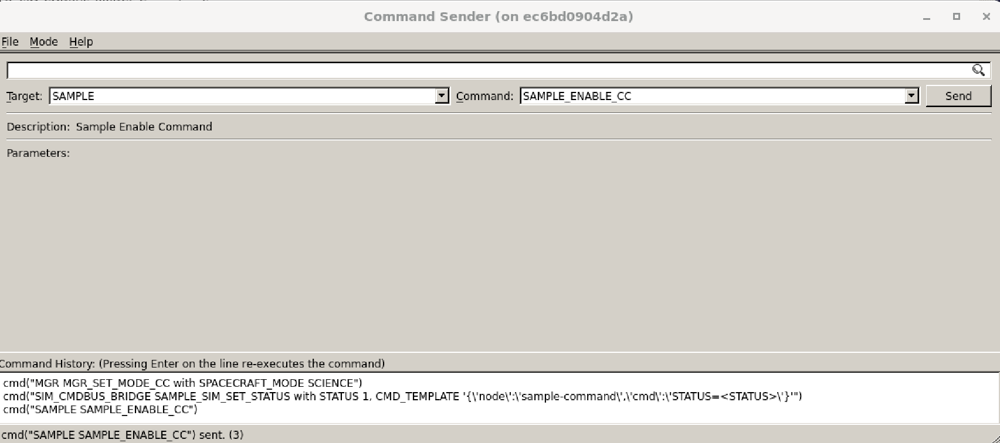
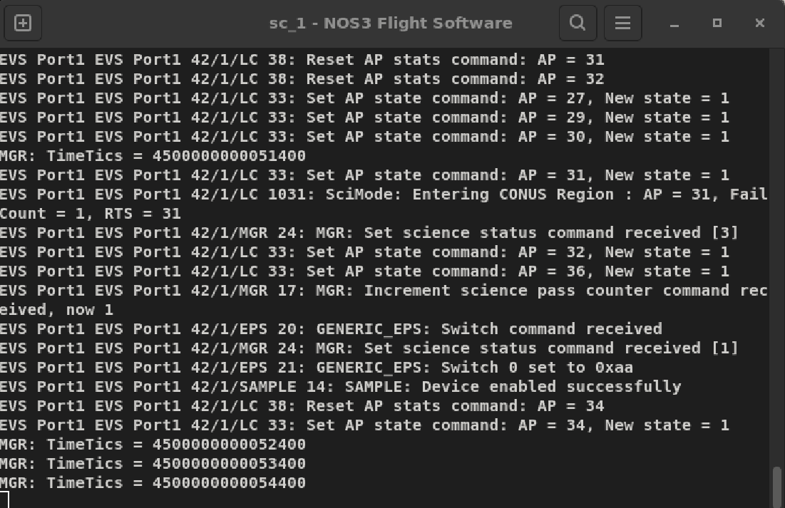
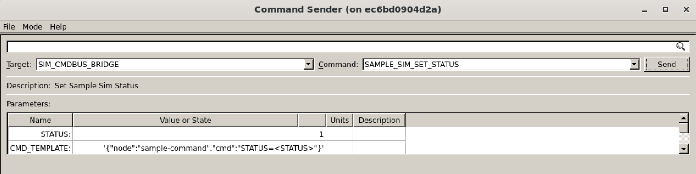
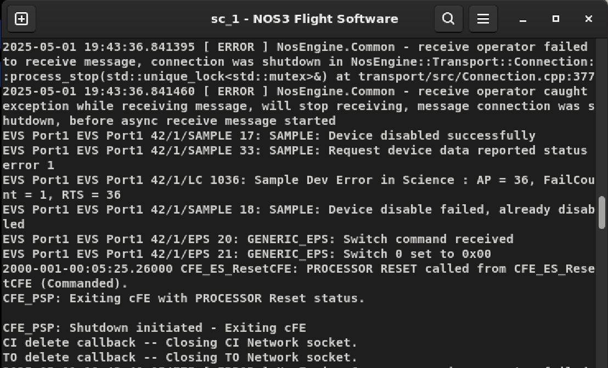
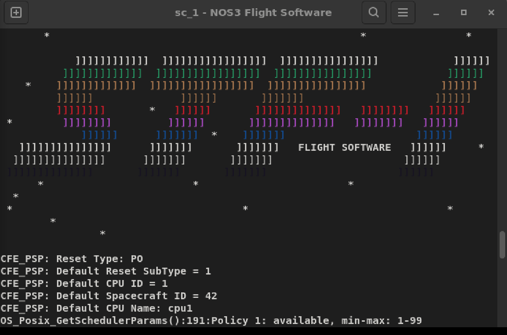
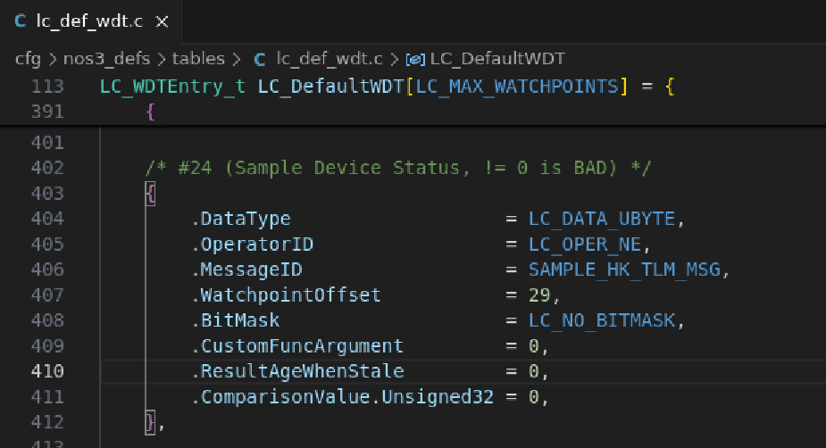
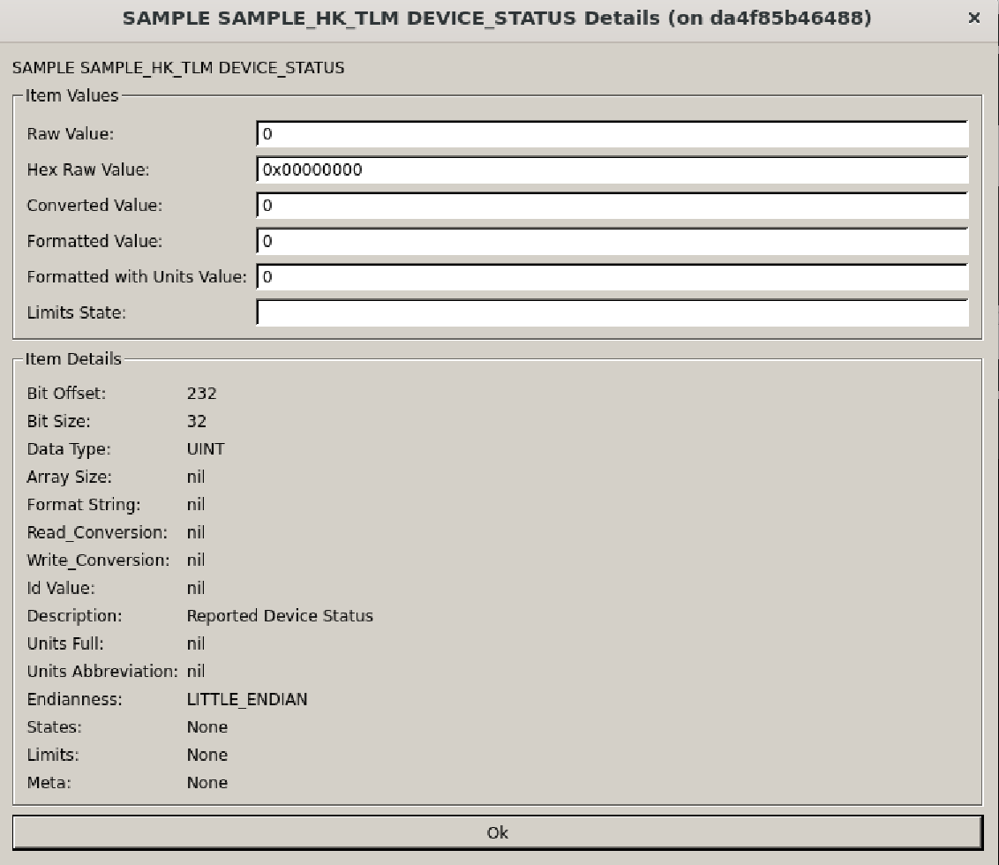
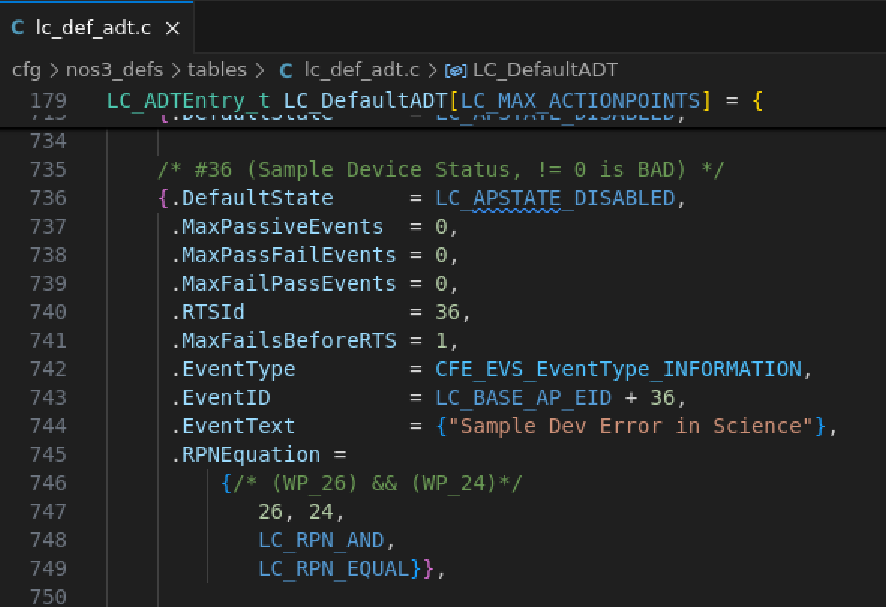

# Scenario - Device Fault in Science Mode

This scenario was developed to provide the user with an example of how the spacecraft can perform Fault Detection & Correction (FDC). It also defines Actionpoints (AP), Watch Points (WP), and Real-Time Sequences (RTS), as well as giving examples of their use in the Limit Checker (LC) and Stored Command (SC) applications in cFS FSW.

This scenario was last updated on 06/06/2025 and leveraged the `dev` branch at the time [a3e7c100].

## Learning Goals

By the end of this scenario, you should be able to:
* Implement a Fault Detection & Correction scenario where the spacecraft detects a fault and resets itself.
* Create a Watchpoint.
* Create an Actionpoint.
* Create an RTS.

## Prerequisites

Before running the scenario, complete the following steps:
* [Getting Started](./NOS3_Getting_Started.md)
  * [Installation](./NOS3_Getting_Started.md#installation)
  * [Running](./NOS3_Getting_Started.md#running)
* No additional file changes or special setup is needed for this scenario.
* It is assumed for this scenario that the user understands how to command the Spacecraft with COSMOS, verify Telemetry via the Packet Viewer, and locate the FSW terminal window.

## Walkthrough

We have a satellite that is behaving oddly. Everything worked during integration and testing on the ground. On orbit however, our Science Instrument is locking up intermittently - and that instrument is the entire reason the spacecraft exists.

We reviewed the telemetry, and our scientists have found that we can detect this error if two criteria are met:
* The spacecraft is in science mode - that is to say that the Manager Spacecraft_Mode is set to 'Science'.
* The device isn't communicating properly - so the Sample_HK_TLM Device_Status field is non-zero.

Scientists have concluded, in this instance, the safest way to handle the lockup is to reboot the spacecraft immediately into safe mode so the spacecraft health can be evaluated and science can resume with as little delay as possible.

Our job, as flight software and ground software experts, is to make this happen.

Follow the walkthrough below to see what the finished product looks like.

Before starting, make sure to launch NOS3 in the default mission configuration in your nos3-mission.xml (sc-mission-config.xml).

### Outlining the Problem

To solve the problem, we must first replicate it, which is the subject of this first section.

---
#### Commanding the Spacecraft into Science mode

Once NOS3 is running and the FSW enters ADCS Mode 2 (Sunpoint Mode), we can command the spacecraft into Science mode.  This is shown below:

This FSW Command will command the spacecraft into Science mode, thereby kicking off RTSs and enabling Actionpoints for this mode:
* For this scenario, we will be watching Actionpoint 36, which is activated under Science Mode.
* We will need to send the `mgr_set_conus` command with value 1. 
* This will allow us to activate the Sample Device whenever the Spacecraft is both in science mode and over North America. This command is seen below:

---
#### Triggering a Simulated Fault with the Sample Device

Now, you can either wait until your Spacecraft is passing over North America, which will enable the sample device, or you can enable it manually in order to speed up this Scenario Walkthrough.

Once the sample device is enabled, you should see the 'sample device enabled' event in cFS, displayed in your FSW window as pictured below. Also, note that AP 36 is activated.

The sample simulator is now communicating with the sample application.  
* The sample application has a scheduled rate at which it requests data from the device.
* To test the RTS, however, there must be a fault in the sample application, which we can simulate as follows:
  * Change to the SIM_CMD_BUS_BRIDGE Target in the Command Sender.
  * This interface enables us to command the simulators directly so we can see how flight software would respond. It serves as a 'backdoor' of sorts.

Let's send the SAMPLE_SIM_SET_STATUS command with a status value of 1.
* This command simulates the detection of a fault on the sample device.

Now, since we have simulated the detection of a fault on the sample device, Actionpoint 36 should be triggered, which will trigger RTS 36. This is pictured below:

* This AP will trigger an RTS that will cause a power cycle event on the spacecraft. Thus, FSW will reset and boot the spacecraft back into safe mode. 
* You should see the STF splash screen come up again in your FSW window, as seen below:

* It is important to understand that we have disabled Actionpoint 36 by default when booting into safe mode, but it is enabled when in Science mode. This is done to protect the spacecraft from resetting cyclically. 
* In order to avoid such cyclic resetting, it is important to disable Actionpoints like this in the appropriate RTS procedures.  This is especially true if a user were to add more APs, WPs, and RTSs like this in the future.

### Solving the Problem

Once we have replicated the problem, we can proceed to solve it.  We will accomplish this by using a combination of Watchpoints, an Actionpoint, and a new RTS 36. These concepts are described below.

#### Creating Watchpoints for cFS

A Watchpoint (WP) is used to monitor individual telemetry values and determine whether they violate predefined conditions. Watchpoints are the fundamental building blocks of Fault Detection and Correction (FDC). A WP monitors a **single** telemetry point, and the LC application updates WPs whenever a packet containing a WP is received. Watchpoints need only be defined once, and can be utilized by multiple Actionpoints.

Basic Watchpoint comparison options are:
* Less Than
* Less Than or Equal
* Not Equal
* Greater Than or Equal
* Greater Than

For this Scenario, our scientists determined that our issue can be detected if two conditions are met. As we evaluated our existing Watchpoints, we find that one of them already exists. Take a look at the WP table and see if you can identify the WP that already exists, and what number it is.

Since one WP already exists, we need to create the other one. For purposes of this scenario, we have already created WP 24 in the LC table found in **nos3/cfg/nos3_defs/tables/lc_def.wdt.c**. This tracks the Device Status telemetry point found in Sample HK, shown below:

Note that the **watchpointoffset** is set equal to 29. This is because the telemetry point bit offset is 232. So 232/8 = 29, which equals the number of bytes needed for the watchpointoffset in our LC table.  The telemetry point bit offset can be found by selecting the Sample Housekeeping packet field in the COSMOS Packet Viewer (Sample_HK_TLM->Device_Status) -> selecting the field -> right clicking on the field -> selecting Details, as shown below:

**Remember, offsets are critical.** A miscalculated offset could have dramatic consequences for a spacecraft. 

---
#### Creating an Actionpoint for cFS

An Actionpoint (AP) is used in Limit Checker (LC) to evaluate a combination of WPs. They allow for boolean logic to combine WPs into more meaningful evaluations. Not only do APs allow for spacecraft automation and response to events, but they also create short messages to help keep ground operators informed regarding the automated actions taking place. APs are evaluated once per second.

It is worth noting that the odd format of AP logic is because it is a form called 'Reverse Polish Notation', also call 'Postfix Notation'.

When the boolean logic of an AP is triggered, two things happen:
* The AP prints out an event text about what condition occurred.
* The AP 'fires' an RTS in response to the triggered condition.

For ease of tracing and troubleshooting, it is important to map an AP to the same RTS number. For example, AP 36 should fire RTS 36. The fewer exceptions to this rule, the better.

For this scenario, we created Actionpoint 36 and added it to the LC table found in **nos3/cfg/nos3_defs/tables/lc_def.adt.c**.  This is pictured below. Note that, as mentioned above, AP 36 is associated with RTS036.

---
#### Creating an RTS

RTS stands for Real-Time Sequence. It is used by the Stored Command (SC) application to automate the execution of predefined command sequences on the spacecraft.

In this scenario, we created an RTS to execute if our AP 36 condition is true. This means that if the sample 'device status' telemetry point is nonzero and we are in science mode (our logic for AP 36), RTS036 will fire and the spacecraft will enter a power cycle event. This in turn resets the FSW as mentioned before. To view the new RTS you can find RTS 36 and review the RTS table in **nos3/cfs/nos3_defs/tables/sc_rts036.c**.

In that RTS table you will see the RTS perform the following tasks, in order:
1. Disable the Instrument Application
2. Disable Instrument Switch on EPS
3. Restart cFS

Again, when we boot cFS after a reset we have AP 36 disabled, thus keeping the spacecraft from entering a FSW reset loop if the device is still broken. We also boot up into safe mode as another precaution.
Note that we disable AP 36 in the Science mode exit RTS (rts029) and we enable AP 36 in the Science mode boot up RTS (rts026). Both of these RTS tables can be found in **nos3/cfs/nos3_defs/tables/**.

---
#### Updating the State Machine

In practice, this exercise is relatively simple. We added one new Watchpoint, defined one new Actionpoint, and wrote a short RTS to reboot our spacecraft - but there's a catch.

When do we turn on this new AP? When do we disable it? How does it fit into the existing state machine of the spacecraft?

Using the diagram below, we see that our new AP should be turned on when we enter Science Mode, and turned off when we return to Safe Mode. Therefore the associated RTSs need to be updated with the correct steps, and the state machine diagram must be updated.

---
#### Conclusion

The user is now able to fault the sample device and have the spacecraft recover itself. Along the way, the user should have gained a better understanding of what an AP, WP, and RTS are and what they do in the cFS.

