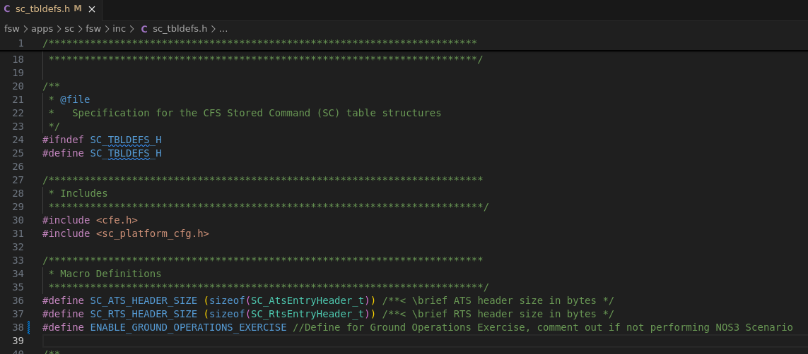

# Scenario - Ground Operations with Random Errors

This scenario was designed as a lab exercise. You are the ground operator in charge of commanding and monitoring the spacecraft. You are performing normal duties when you notice anomalies on board the spacecraft. This exercise is intended to only use COSMOS GSW in order to successfully maintain your spacecraft, identify errors and provide solutions to make sure your spacecraft is in a nominal state as expected. 

This scenario was last updated on 6/20/2025 and leveraged the `dev` branch at the time.

## Learning Goals

By the end of this scenario, you should be able to use COSMOS GSW effectively to:
* Command the spacecraft. 
* Monitor telemetry. 
* Debug anomalies.
All this while the spacecraft is in a simulated orbit.

## Prerequisites

Before running the scenario, complete the following steps:
* [Getting Started](./NOS3_Getting_Started.md)
  * [Installation](./NOS3_Getting_Started.md#installation)
  * [Running](./NOS3_Getting_Started.md#running)
* It is assumed for this scenario that the user understands how to command the Spacecraft and verify telemetry with COSMOS.

## Walkthrough
This scenario is intended to simulate ground operations of a spacecraft. It is your job as a ground operator to utilize GSW (COSMOS) to monitor the overall health of the spacecraft. 

To enable this scenario there is a Macro in NOS3 that needs to be uncommented. This macro can be found in **nos3/fsw/apps/sc/fsw/inc/sc_tbldef.h**. See Below:

After uncommenting the macro, make sure NOS3 is in the default mission configuration in your nos3-mission.xml (sc-mission-config.xml). Then **make clean** and **make** building NOS3 in a terminal within your NOS3 project directory.

**IMMEDIATELY MINIMIZE ALL WINDOWS EXCEPT COSMOS WINDOWS!**

We are minimizing everything except COSMOS to simulate normal ground operations for a spacecraft. Please keep these windows minimized for the purpose of this exercise. 

Also, for the purpose of this exercise, we are assuming we have unlimited time for a orbital pass, thus we have constant communication with the spacecraft. In practice, our orbital pass time frame is limited.

Hint: There are 10 "errors" or anomalies being triggered. It is up to you to identify these anomalies, and command the spacecraft so that they are resolved and/or the spacecraft is commanded back to a nominal state.

If you are stuck, the fsw window will help you identify what is happening onboard the spacecraft.

## Conclusions

The user is now able to act as a ground operator and identify spacecraft anomalies and monitor the overall health and safety of a spacecraft.

