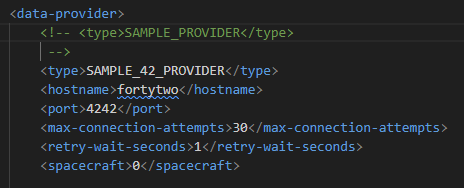
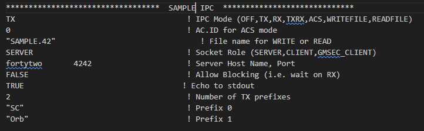
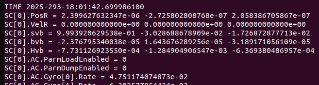
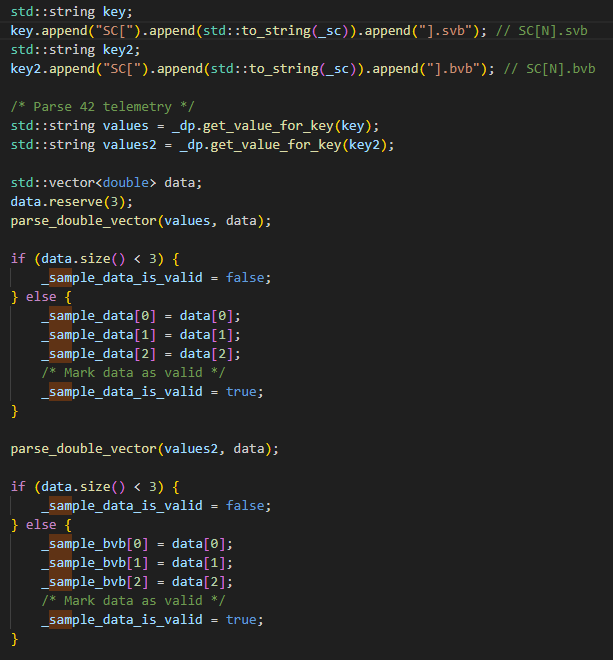
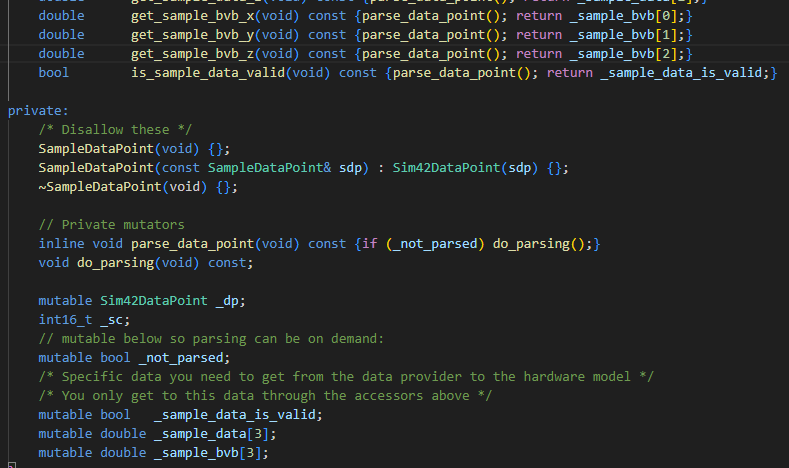
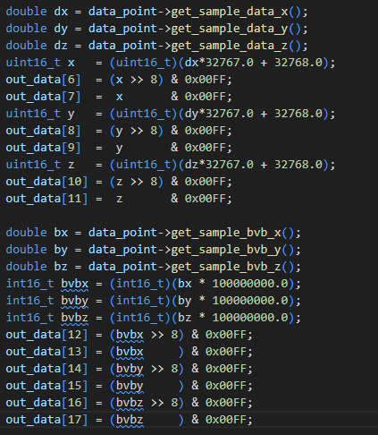
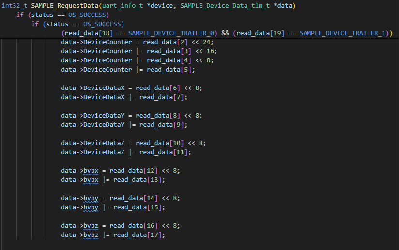
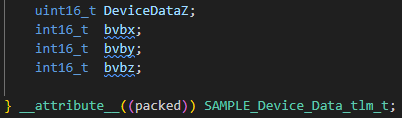
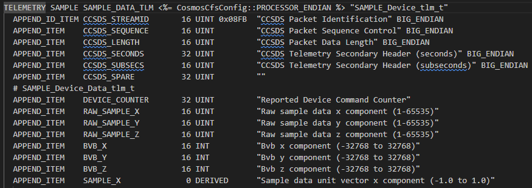
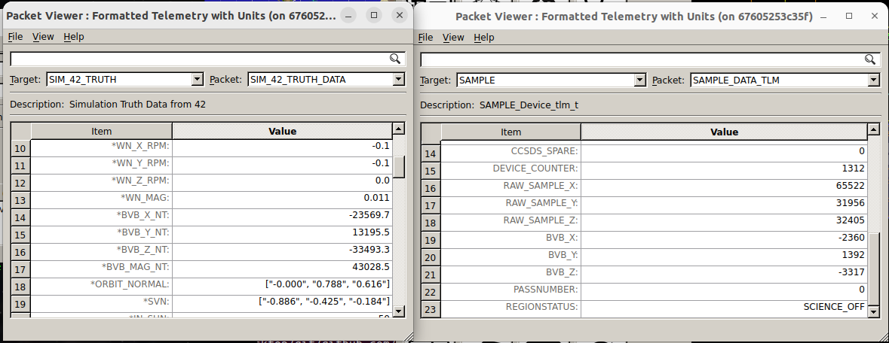

# Scenario - Simulator Expansion

This scenario was developed to explain how to expand a simulator.
In this scenario, we will expand the Sample simulator to use additional data from 42.
This scenario will show how data flows through the entire system: The data starts at 42, passes to the simulator, which talks to the component application, and then that component application publishes COSMOS telemetry.

This scenario was last updated on 06/06/2025 and leveraged the `dev` branch at the time [53d4627].

## Learning Goals

By the end of this scenario, you should be able to:
* Turn on 42 output in the 42 window.
* Enhance the Sample simulator to retrieve additional data from 42.
* Enhance the Sample simulator to provide additional data to flight software.
* Enhance the Sample flight software to receive additional data from the simulator and to provide additional telemetry for the additional data.
* Enhance the Sample telemetry definition to view additional telemetry for the additional data.
* Run NOS3 and view the additional data in the Sample telemetry.

## Prerequisites

Before running the scenario, complete the following steps:
* [Getting Started](./NOS3_Getting_Started.md)
  * [Installation](./NOS3_Getting_Started.md#installation)
  * [Running](./NOS3_Getting_Started.md#running)
* No additional file changes or special setup is needed for this scenario.

## Walkthrough

Before we start using additional 42 data, it would be useful to see what data 42 provides.  We will do this by turning on 42 output in the 42 terminal window, so that when NOS3 is running we can see all the data coming in from 42.

### Turn on 42 output in the 42 window

First, we will turn on the 42 data provider:
* Edit `cfg/sims/nos3-simulator.xml`.
  * Locate the "sample_sim" simulator section.  
  * Comment out the "SAMPLE_PROVIDER" section and uncomment the "SAMPLE_42_PROVIDER" section:

Next, we have to ensure that the 42 data knows where it is going (and is going to the correct place):
* Edit `cfg/InOut/Inp_IPC.txt`.
* Add an 11 line section to the end that is like the previous section. 
  * Change the filename to "SAMPLE.42".
  * Change the host port to `4242` and echo to stdout to `TRUE`.

Now, to test:
* Change line 2 to be one more than the current value.
* Run `make`, then `make launch`
The 42 terminal window should now show 42 output:

Run `make stop` to clean up.

### Enhance the Sample simulator to retrieve additional data from 42

Now that we can see the data, we have decided that getting the magnetic field vector (bvb) information would be useful:
* Edit the `components/sample/sim/src/sample_data_point.cpp` file.
* Add another key to extract the "SC[0].bvb" data.
* Add line to get value for key.
* Add parsing and saving of the "bvb" data.

* Add "\_sample_bvb" array to the "SampleDataPoint" and add getter methods (`sample_data_point.hpp`). This file can be found `components/sample/sim/inc`.

### Expand the Sample Simulator 

The sample simulator is now receiving the additional data we selected, but it is not currently being used or sent anywhere.  We can change that, passing the data back to the FSW:
* Edit the `components/sample/sim/src/sample_hardware_model.cpp` file.
* Add "bvb" data to the out_data in the "create_sample_data()" method. Note be sure to change the size of the out_data (out_data.resize(14, 0x00)) to 20, increasing the original value from 14. This is defined at top of the method.

Now, to test, we will launch everything:
* Run `make clean`, then `make`, and`make launch`.
* The 42 window should now show 42 output and the sample sim window should show a connection to get the 42 data.
* Run `make stop`.

### Enhance the Sample Flight Software 

Next, we will expand the capabilities of the sample_device:
* Edit the `components/sample/fsw/shared/sample_device.c` file.
* Add "bvb" data reads in the "SAMPLE_RequestData()" function. 
**Note, since we have increased our data buffer, we are changing the conditional to check read_data indices 18 and 19 in order to find the appropriate trailer message.**

* Edit the `components/sample/fsw/shared/sample_device.h` file.
* Add "bvb" members to the "SAMPLE_Device_Data_tlm_t" structure.

### Enhance the Sample Telemetry Definition 

Lastly, we will expand the Sample telemetry definition to include the bvb data:
* Edit the `components/sample/gsw/SAMPLE/cmd_tlm/SAMPLE_TLM.txt` telemetry definition file.
* Add "bvb" telemetry points to the "SAMPLE_DATA_TLM" telemetry packet.

### Run NOS3 and view the additional data in the Sample telemetry

Once the simulator expansion has been accomplished as above, we can test it by running NOS3. It should look something like the following:

### Conclusion

In this scenario, we have added additional 42 data to the Sample app. The process is largely similar for expanding or enhancing any of the simulators, even an entirely original one.
